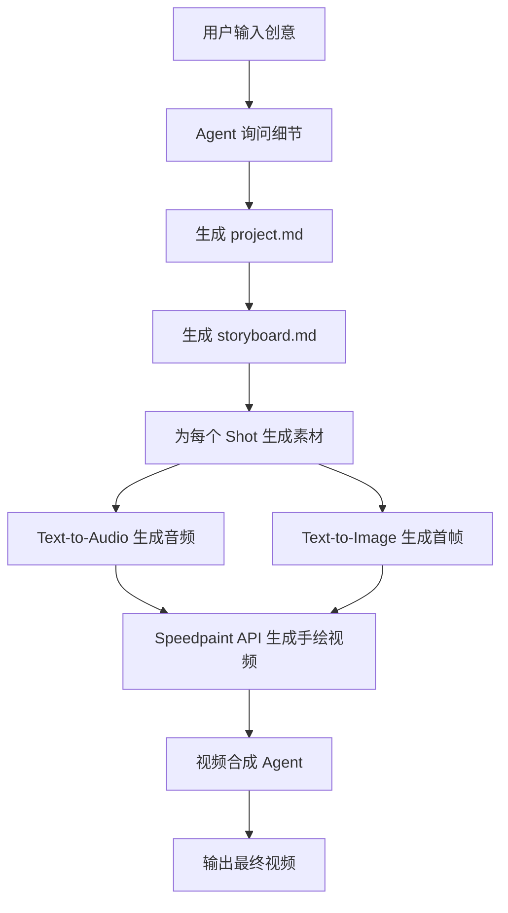
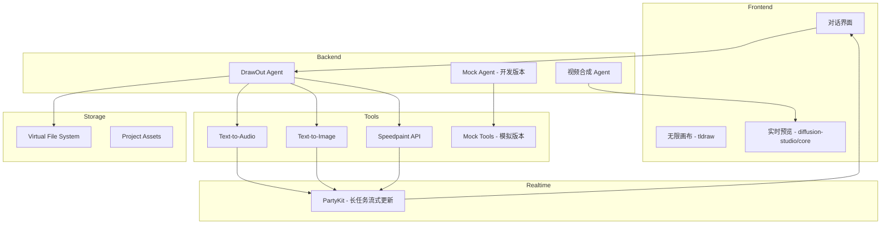

# DrawOut.ai 产品需求文档

## 1. 产品介绍

DrawOut.ai 是一款专注于"白板手绘风格解释视频"的 AI 视频创作工具。我们致力于将复杂的概念、产品或服务，通过引人入胜的手绘动画形式，清晰、高效地传达给观众。

与通用的视频生成工具不同，DrawOut.ai 在底层能力上虽然涵盖了强大的 AI 视频生成技术，但我们的核心优势在于对白板动画这一垂直领域的深度优化。我们独有的 **Speedpaint API**，能够基于静态图片生成流畅、自然的手绘过程视频，为解释性内容带来独特的视觉吸引力和节奏感。我们的目标是成为知识传播者、市场营销人员和教育工作者的首选工具，帮助他们轻松创作出专业级的白板解释视频。

## 2. 行业洞察与设计哲学

### 2.1. 核心洞察

1.  **市场正在分化：** AI 视频领域正从"技术展示"走向"实用工具"，并出现明显分化。一类是追求极致真实感的"电影级"通用模型（如 Sora）；另一类是降低使用门槛的"大众化"工具（如 Luma Dream Machine）；还有一类是专注于特定应用的"垂直工具"（如 Synthesia）。**DrawOut.ai 选择成为第三种。**
2.  **"可控性"是关键战场：** 角色一致性、镜头控制、动作指定等"可控性"特性，已成为决定产品能否用于严肃创作的生命线。
3.  **工作流大于单一功能：** 用户需要的是一个整合了多种 AI 能力，并允许人类在关键节点进行干预和微调的完整"创作工作流"，而非孤立的功能。
4.  **"解释视频"是黄金赛道：** 营销和教育领域对"解释视频"的需求巨大，这类视频重在清晰传递信息，与手绘风格天然契合，这能最大化发挥我们 `speedpaint` API 的独特优势。

### 2.2. 设计哲学

- **垂直优先：** 我们不追求"大而全"，而是要"小而美"。所有功能设计都应首先服务于"白板解释视频"这一核心场景。
- **人机协作：** AI 是强大的副驾驶，而不是全自动的司机。我们的产品应该赋能创作者，而不是取代他们。在工作流的每一个环节，都应为人类的创意、干预和微调留出空间。
- **工作流至上：** 我们交付给用户的应该是一个从"想法"到"成品"的端到端解决方案，而不是一堆零散的功能。故事板、角色库、镜头语言等都应是这个工作流中的有机组成部分。

---

## 3. 功能详细说明

### 3.1. 核心工作流：从想法到故事板

DrawOut.ai 的核心是一种全新的、以"故事板"为中心的创作范式。

#### 3.1.1 完整工作流程

#### 3.1.2 详细步骤说明

1. **项目初始化阶段**
   - 用户输入初始创意（例如："一个关于'光合作用'的科普视频，面向小学生"）
   - Agent 通过对话了解关键信息：目标受众、视频时长、语调风格、行动号召等
   - 生成 `project.md` 文件，包含项目的所有配置信息

2. **故事板生成阶段**
   - 基于 project.md，Agent 生成结构化的 `storyboard.md`
   - 故事板包含多个有序的镜头（Shots）
   - 每个镜头定义了场景、旁白、视觉概念等

3. **素材生成阶段**
   - 对每个 Shot 并行生成所需素材：
     - 使用 Text-to-Audio 工具生成旁白音频
     - 使用 Text-to-Image 工具生成插画风格的首帧图片
   - 将音频和首帧图片输入 Speedpaint API，生成手绘过程视频

4. **视频合成阶段**
   - 专门的合成 Agent 生成轨道描述数据（JSON格式）
   - 定义转场效果、时间轴、音视频同步等
   - 输出最终的解释视频

### 3.2. 关键概念

#### a. 故事板 (Storyboard)

故事板是视频的蓝图，是组织所有视觉和叙事元素的核心容器。它在我们的产品中是一个一等公民。

#### b. 镜头 (Shot)

每个镜头是故事板的基本单位，包含以下可控元素：

- **场景描述：** 对场景环境的文本描述。
- **出场角色：** 从"角色库"中选择，或动态生成。
- **角色动作/表情：** 对角色行为和情绪的描述。
- **画外音/字幕：** 这个镜头的旁白或字幕文本。
- **镜头语言：**
  - **类型：** 特写、中景、全景等。
  - **运动：** 推、拉、摇、移、跟等。
  - **角度：** 俯视、仰视、平视等。
- **生成方式：**
  - **Speedpaint：** 用于生成核心讲解对象的手绘动画（当前版本专注于此）。
  - **AI 视频：** 用于生成复杂的动态背景或非核心对象的运动（未来版本）。

#### c. 角色库 (Character Library)

- 用户可以上传自己的角色图片（例如，公司吉祥物、课程主讲人卡通形象），或使用 AI 生成并保存。
- 一旦角色被添加到库中，就可以在项目中重复使用，AI 将确保其在所有镜头中的外观、画风保持高度一致。

### 3.3. 视频合成与导出

- 当用户对故事板满意后，可以启动"一键合成"功能。
- AI 代理将根据每个镜头的设定，智能地调用相应的引擎（通用 AI 视频模型或 `speedpaint` API）进行渲染。
- 最终，所有镜头将被无缝地拼接在一起，并配上画外音和字幕，生成一个完整的视频文件。

---

## 4. 技术架构

### 4.1. 系统架构

### 4.2. 数据结构定义

#### Project 数据结构

参考 `@docs/references/automation-chatbot/project.ts`，包含：

- 视频主题、目标受众、语调风格
- 视频时长、行动号召
- 视觉设置（画面比率、线条风格、颜色方案等）

#### Storyboard 数据结构

参考 `@docs/references/automation-chatbot/story.ts`，包含：

- 脚本ID、标题
- 场景数组（scenes），每个场景包含：
  - 场景ID、标题、时长
  - 旁白文本（narration_text）
  - 视觉概念提示词（visual_concept_prompt）

### 4.3. Mock 开发架构

为了快速验证流程，我们将创建 Mock 版本：

1. **Mock Agent**
   - 复用 drawout-agent.ts 的 instructions
   - 使用 mock 版本的工具

2. **Mock Tools**
   - Mock Text-to-Audio: 返回预置音频文件，延迟 3 秒
   - Mock Text-to-Image: 返回预置插画图片，延迟 3 秒
   - Mock Speedpaint: 返回预置手绘视频，延迟 3 秒

3. **预置资源**
   - 存放在 `/assets/mock/` 目录下
   - 包含示例音频、图片、视频文件

---

## 5. 竞品分析

| 产品            | 交互类型 | 官方简介                                                                                                                         |
| --------------- | -------- | -------------------------------------------------------------------------------------------------------------------------------- | ------------------------------ |
| **lovart**      | 画布     | Lovart                                                                                                                           | The World's First Design Agent |
| **recraft**     | 画布     | Infinite AI Artboard                                                                                                             |
| **Flowit**      | 画布     | Your Supercharged AI Creation Workspace, with Knowledge                                                                          |
| **VIDU**        | 表单     | Vidu AI - 极速生成高质量创意视频,用AI轻松表达想法                                                                                |
| **Pollo**       | 表单     | Start your generation with Pollo AI, or explore the creations from other community members                                       |
| **Kling AI**    | 表单     | Kling AI: Next-Gen AI Video & AI Image Generator                                                                                 |
| **Leonardo.Ai** | 表单     | Leverage generative AI with a unique suite of tools to convey your ideas to the world.                                           |
| **豆包**        | 对话     | 豆包是你的AI聊天智能对话问答助手,写作文案翻译编程全能工具。豆包为你答疑解惑,提供灵感,辅助创作,也可以和你畅聊任何你感兴趣的话题。 |

### 相同点

- 图片和视频生成的时间较长, 过程中不阻塞用户交互, 甚至在网页关闭后不关闭生成任务
- 在 Prompt 等需要输入的位置提供示例、模板, 降低新用户的使用门槛
- 支持查看、恢复历史版本
- 对于画布类型, 历史版本不会直接显示在画布中, 而是在选中对象后在底部显示

### 差异点

- 对于输出内容的二次编辑, 采用类似 Figma 选中对象、弹出工具窗口的交互方式
- 更接近传统的设计工具, 例如支持插入文字, 修改文字样式、进行排版。
- Agent 都展示了思考、操作的工作流程
- **对话类型**
  - 在对话流中点击输出的内容支持打开窗口进行编辑
    - 在其他同类产品中, 根据内容的不同会打开不同的编辑界面
      - **图片:** 画布
      - **文字/代码:** 文本/代码编辑器
- **控制台类型**
  - 采用比较复杂的表单让用户控制创作的参数
  - 创作窗口右侧显示正在创作、历史创作的作品。
- **都拥有社区**
  - 提升产品活跃度
  - 通过社区案例降低用户创作门槛

### 整体上来说

- **画布类工具:** 更多是针对有明确目标的用户, 例如运营人员可以快速生成活动海报。是一个生产力工具。
- **表单类工具:** 具备比较强的娱乐、社交属性, 例如建立社区分享自己的作品, 分享到主流社交平台等。

### 按类型比较

- **画布类型**
  - **Lovart** 除了传统的对象编辑窗口, 还提供了与AI的线性对话窗口, 为与 Agent 的沟通提供支持 (从官方介绍「The World's First Design Agent」也可以推测出)。
  - **Flowith** 在展示 Agent 工作流时没有使用对话窗口, 而是独立的列表(只读, 不能)
- **控制台类型**
  - **Pollo** 提供了翻译功能, 帮助用户将 Prompt 翻译为英文以获得更好地效果
  - **Vidu** 支持将图片作为变量插入到 Prompt 中

### 借鉴点

- 生成过程不阻塞 UI
- 用户输入的位置提供示例、提示, 降低使用门槛
- 支持查看、恢复历史版本
- 展示 Agent 思考、工作流程
- 支持人工干预, 对输出结果进行二次修改

---

## 6. 需求范围

### 功能

| 功能           | 子功能       | 描述                                 | 前置条件             | 后置条件                   | 其他                        |
| -------------- | ------------ | ------------------------------------ | -------------------- | -------------------------- | --------------------------- |
| **开启新项目** | 开启新项目   | 输入 Prompt 触发 Agent 开始工作      | 项目为空/初始状态    | 进入拥有画布的创作界面     |                             |
| **画布**       | 展示输出结果 | 当前版本不支持移动画布中的内容       |                      |                            |                             |
|                | 缩放画布     | 缩放画布, 放大/缩小画布中的内容      | 鼠标位于画布中       |                            | MacBook 触控板/鼠标滚轮     |
|                | 移动画布     | 移动画布                             |                      |                            | MacBook 触控板/按住空格拖拽 |
|                | 移动画布内容 | 移动画布中的内容                     | 按住对象拖拽移动     | 松开鼠标停止移动           |                             |
|                | 选中输出结果 | 选中画布中的文档、图像等元素         | 点击画布中的输出结果 | 选中对象显示属性、操作窗口 | 支持多选 (按住 Shift 点击)  |
|                | 多选输出结果 | 选中画布中的多个元素                 | 选中多个元素         | 显示操作窗口               |                             |
|                | 修改输出结果 | 修改画布中的输出结果                 | 选中修改对象         | 拷贝选中对象               |                             |
|                | 引用关系     | 显示画布中的引用关系                 | 选中对象             | 高亮相关的文档             |                             |
|                | 右键菜单     | 在元素上右键点击                     | 右键点击             | 显示操作菜单               | Copy, Duplicate, Delete     |
|                | 删除元素     | 删除画布中的元素                     | 选中元素, 点击删除   | 移除画布中的元素           |                             |
| **对话窗口**   | 发送消息     | 发送消息与AI 交互                    |                      |                            |                             |
|                | 引用外部数据 | 支持引用本地文件、Web Link、画布数据 |                      | 引用的数据显示在输入框附近 |                             |
|                | 显示输出结果 | 包括 Storeline、图片、视频           | 用户发送消息         | AI 回复输出结果            |                             |

---

## 7. 非功能需求

- 产品营销需求、运营需求、财务需求、法务需求、使用帮助、问题反馈等
- **暂无**

---

## 8. 参考资料

- [Vidu API 平台](https://vidu.ai)
- [tldraw: Build whiteboards in React with the tldraw SDK](https://www.tldraw.dev/)
