# DrawOut.ai Agent: Implementation Plan (v2)

## 1. Core Philosophy: Plan-Driven, VFS-Centric

我们的 Agent 架构基于两大核心原则：计划驱动的执行与虚拟文件系统中心化。

- **Plan-Driven Execution:** Agent 的所有行为都由一个名为 `plan.md` 的文件严格指导。这个文件是 Agent 根据用户需求和故事板生成的、详细的、带检查项的行动列表。这确保了 Agent 的行为是可预测、可审计的，并且在执行长链任务时不会偏离轨道。

- **Virtual File System (VFS) Centric:** Agent 的工作空间是一个隔离的虚拟文件系统。所有的思考（`plan.md`）、规划（`storyboard.md`）、资产（图片、音频、视频片段）和最终产出都作为文件持久化在 VFS 中。这为我们提供了极佳的可观测性、可调试性，并为未来的人工干预创造了完美的接入点。

## 2. Virtual File System (VFS) Structure

每个项目在 VFS 中的标准目录结构如下，以反映“故事板-场景-镜头”的层级关系：

```
project-root/
├── project.md             # 项目核心设定 (Source of Truth)
├── plan.md                # Agent 的详细行动计划 (Execution Script)
├── storyboard.md          # 故事板，定义了场景和镜头
├── composition.md         # 最终合成指令
├── scenes/                # 所有媒体资产的根目录
│   └── scene-01/            # 对应 storyboard 中的一个场景
│       ├── shot-01/         # 对应一个镜头
│       │   ├── image-01.png # 镜头所需图片1
│       │   ├── image-02.png # 镜头所需图片2 (可选，用于迭代或参考)
│       │   ├── narration.mp3  # 镜头的旁白音频
│       │   └── speedpaint.mp4 # 由 speedpaint 工具生成的视频片段
│       └── shot-02/
│           └── ...
└── final/
    └── final_video.mp4      # 最终合成的视频
```

## 3. The Agent Workflow

Agent 的工作流程被重新设计为一系列由 `plan.md` 驱动的步骤：

**Step 1: Project Initialization**

- **Trigger:** 用户提供初始需求。
- **Agent's Task:** 与用户对话，确认核心需求。
- **Artifact:** 生成 `project.md` 文件。

**Step 2: (Optional) Research**

- **Trigger:** The topic in `project.md` requires factual information.
- **Agent's Task:** Call the `research` tool to gather information.
- **Artifact:** A detailed report is saved to `research/report.md`.

**Step 3: Storyboard Generation**

- **Trigger:** `project.md` 创建成功。
- **Agent's Task:** 读取 `project.md`，构思并生成 `storyboard.md`。
- **Artifact:** 生成 `storyboard.md` 文件。

**Step 3: Planning**

- **Trigger:** `storyboard.md` 创建成功。
- **Agent's Task:** 解析 `storyboard.md`，生成一份详尽的、包含所有后续操作的行动计划。
- **Artifact:** 生成 `plan.md` 文件。

**Step 4: Plan Execution**

- **Trigger:** `plan.md` 创建成功。
- **Agent's Task:** 作为核心执行循环，Agent 逐一执行 `plan.md` 中的任务项，并勾选已完成项。这个过程包括：
  1.  根据 `storyboard.md` 创建 VFS 目录结构（例如 `scenes/scene-01/shot-01/`）。
  2.  为指定镜头调用 `generate_image` 工具。
  3.  为指定镜头调用 `generate_audio` 工具。
  4.  **Dependency Check:** 持续检查 `plan.md`，当发现某个 `shot` 的图片和音频任务都完成后，才将 `generate_speedpaint` 任务加入待执行队列或立即执行。
  5.  调用 `generate_speedpaint` 工具，使用该 `shot` 下的指定图片和音频时长作为输入。

**Step 5: Composition Generation**

- **Trigger:** `plan.md` 中所有资产生成任务均已完成。
- **Agent's Task:** 扫描 `scenes` 目录，汇总所有 `speedpaint.mp4` 和 `narration.mp3` 文件信息。
- **Artifact:** 生成 `composition.md` 文件，其中包含用于视频合成的甘特图。

**Step 6: Final Synthesis**

- **Trigger:** 用户发出“合成”指令。
- **Agent's Task:** 调用 `synthesize_video` 工具，并将 `composition.md` 的路径作为参数传入。
- **Artifact:** 在 `final/` 目录下生成最终的视频文件 `final_video.mp4`。

## 4. Tool Definitions

```typescript
interface Tools {
  generate_image(
    prompt: string,
    style: string,
    output_path: string,
  ): Promise<string>
  generate_audio(
    text: string,
    voice: string,
    output_path: string,
  ): Promise<{ file_path: string; duration_seconds: number }>
  generate_speedpaint(
    image_path: string,
    duration_seconds: number,
    output_path: string,
  ): Promise<string>
  synthesize_video(composition_path: string): Promise<string>
}
```

## 5. File Format Specifications

### `plan.md` (New)

一份详细的待办事项列表，Agent 会在执行过程中更新它。

```markdown
# DrawOut.ai Execution Plan

## Scene 1

### Shot 1.1

- [x] Create directory: `scenes/scene-01/shot-01/`
- [x] Generate image: `scenes/scene-01/shot-01/image-01.png`
- [x] Generate audio: `scenes/scene-01/shot-01/narration.mp3`
- [ ] Generate speedpaint: `scenes/scene-01/shot-01/speedpaint.mp4`

### Shot 1.2

- [ ] Create directory: `scenes/scene-01/shot-02/`
- [ ] Generate image: `scenes/scene-01/shot-02/image-01.png`
- [ ] ...
```

### `project.md`

```yaml
---
theme: '介绍光合作用的基本原理'
target_audience: '小学生'
aspect_ratio: '16:9'
style: '简约、友好的卡通风格'
---
```

### `storyboard.md`

```markdown
# Scene 1: 什么是光合作用？

## Shot 1.1

- **Image Prompt:** 一棵可爱的卡通大树在阳光下微笑，旁边有一朵云和太阳。
- **Image to use:** `image-01.png` (Agent or user can specify which image to use for speedpaint)
- **Voiceover Text:** "嘿，小朋友们！你们知道我是怎么吃饭的吗？"

## Shot 1.2

- ...
```

### `composition.md`

甘特图现在引用每个 `shot` 目录下的具体资产路径。

````markdown
---
version: 1.0
aspect_ratio: '16:9'
---


```mermaid
gantt
    title Video Composition Timeline
    dateFormat  HH:mm:ss
    axisFormat %S

    section Scene 1
    Shot 1.1 Audio :track-a1, 00:00:00, 4s
    Shot 1.1 Video :track-v1, 00:00:00, 4s

    section Scene 2
    Shot 1.2 Audio :track-a1, after track-v1, 6s
    Shot 1.2 Video :track-v1, after track-v1, 6s
```

````

**渲染说明:**
合成引擎在解析甘特图时，会结合 VFS 结构来定位文件。

- `Shot 1.1 Audio` 对应 `scenes/scene-01/shot-01/narration.mp3`。
- `Shot 1.1 Video` 对应 `scenes/scene-01/shot-01/speedpaint.mp4`。
- `track-a1`, `track-v1` 定义了音频和视频轨道。
