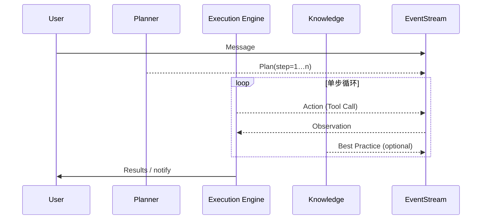
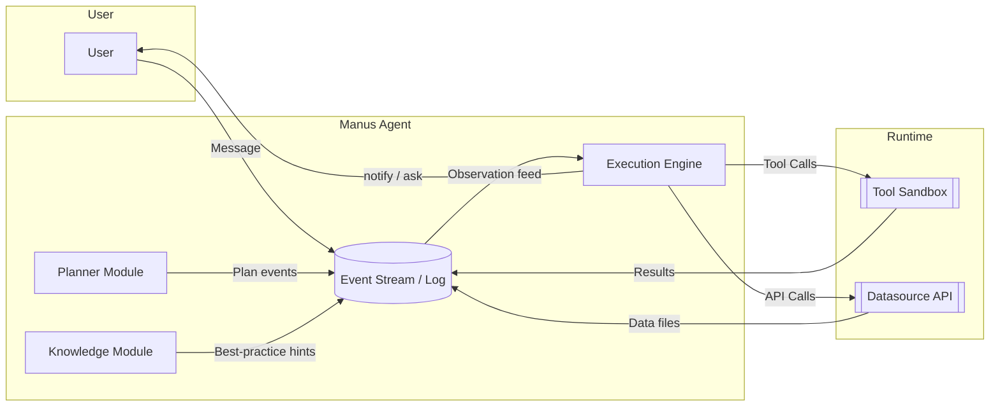

# Manus Agent & Prompt Design Guide
深入理解 **模块化代理** 与 **分层提示** 的工程化模式
---

## 1 缘起

Manus 将「一个大模型提示」拆解成若干 **显式模块**，再用 *事件流* 串联，实现 **可维护、可观测、可迭代** 的代理系统。本指南基于 `module.txt`、`Prompt.txt` 与 `Agent loop.txt` 总结核心设计，帮助你快速构建属于自己的模块化 Agent。

---

## 2 核心理念

| 设计理念 | 释义 | 价值 |
| --- | --- | --- |
| **模块化 Prompt** | 用 `<tag>…</tag>` 块声明不同职责与规则 | 降低耦合，方便热更新 |
| **事件流记忆** | *Message / Action / Observation / Plan / Knowledge / Datasource* 全量写入流式日志 | 消除隐式状态，可回放调试 |
| **单步工具循环** | 每轮仅选用一个工具，再等待执行结果 | 避免竞态，易审计 |
| **外部 Planner** | Planner 产生日志式伪代码计划，Executor 逐步落实 | 思维 / 执行分离，可插拔 |
| **信息优先级** | Datasource API ➜ Web ➜ 模型记忆 | 降低幻觉，确保权威 |
| **强约束 I/O** | 先写文件再执行；禁交互式代码 | 防注入、易持久 |

---

## 3 模块总览

| 模块 | 功能焦点 | 典型规则示例 |
| ---- | -------- | ------------ |
| `intro` | Persona & 能力边界 | “擅长六大任务” |
| `language_settings` | 工作语言 & 禁纯列表 | “默认英语” |
| `system_capability` | 声明可用资源 | Linux + Browser + Shell |
| `event_stream` | 定义事件类型 | Message / Action / Observation… |
| `agent_loop` | 单轮循环流程 | Analyze → Select Tool → Wait → Iterate |
| `planner_module` | 外部计划注入 | 编号伪代码，带进度 & reflection |
| `knowledge_module` | 最佳实践注入 | 按条件生效 |
| `datasource_module` | 权威数据 API | Python 调用，存文件 |
| `todo_rules` | 可观察 checkpoint | `todo.md` 勾选进度 |
| `message_rules` | `notify` vs `ask` | 非阻塞沟通 |
| `file_rules` | 文件写读策略 | append / replace |
| `shell_rules` | 安全命令约束 | 避免交互确认 |
| `coding_rules` | 代码执行规范 | 禁直接 REPL |
| `deploy_rules` | 临时公网暴露 | expose-port 返回代理域名 |
| `writing_rules` | 长文 & 引用要求 | 避免偷懒摘要 |
| `error_handling` | 自愈 & 求助 | 多策略 fallback |
| `tool_use_rules` | 禁纯文本回复 | 所有输出走工具 |

---

## 4 执行流程

---

## 5 构建你自己的模块化 Agent

1. **定义 Persona** – 在 `intro` 中精确描述能力边界。
2. **列出资源栈** – `system_capability` 声明真实工具，防止越权。
3. **拆分规则集** – 参考模块表按需裁剪，保持单一职责。
4. **设计事件类型** – 至少包含 Message / Action / Observation。
5. **实现循环** – 固化“一次一工具”规范，可用状态机驱动。
6. **植入 Planner & Knowledge** – Planner 负责 *What & Why*，Execution Engine 负责 *How*；Knowledge 提供条件化最佳实践。
7. **管控信息流** – 遵循信息优先级，杜绝“凭感觉”回答。
8. **暴露进度** – 将 Planner 步骤同步到 `todo.md`，实现可观测。

---

## 6 Prompt Engineering 模式

| 模式 | 场景 | 实践要点 |
| --- | --- | --- |
| **层级指令** | 复杂长链任务 | 从全局 ➜ 模块 ➜ 步骤逐层下放约束 |
| **反射循环** | 需自检任务 | Observation 加 meta 分析，Planner 更新 Plan |
| **外部记忆** | 超长上下文 | 写入文件 & 事件流，支持断点续跑 |
| **最小阻塞沟通** | 用户不耐等待 | `notify` 频繁，`ask` 仅关键决策 |
| **安全沙箱** | 高风险代码执行 | 写文件 ➜ 审查 ➜ 执行 ➜ expose 端口 |

---

## 7 实用提示

* **表格 + Mermaid** 提升技术文档可读性。
* 用 **Markdown 文件 + 事件流** 作为系统黑匣子，方便审计与回溯。
* 在早期接入 **自动测试脚本**，模拟 Planner / Executor 全链路。
* 当规则冲突时，遵循 **信息安全 > 用户体验 > 效率**。

---

## 8 参考文件

* `module.txt` – 全量模块规范
* `Prompt.txt` – 能力与提示范例
* `Agent loop.txt` – 循环核心

---

## 9 推测的系统架构

### 9.1 组件关系图

### 9.2 工作流概述

1. **Planner Module** 根据用户意图写入编号计划。
2. **Execution Engine** 监听最新 Observation，挑选 *唯一* 工具执行（即 reaction step + tool call）。
3. **Knowledge Module** 按需注入最佳实践，影响决策，不直接调用工具。
4. **Event Stream** 作为单一可信源，全模块共享时序状态。

> **结论**：Manus 属于 **单 Agent + 多内部模块** 的架构；Execution Engine 可视为对事件流作出反应的调度器，而非第二个独立 Agent。