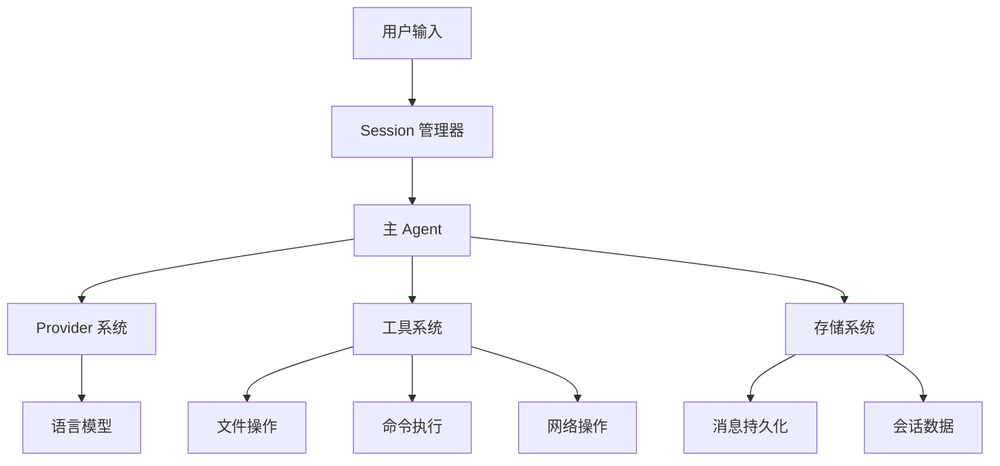
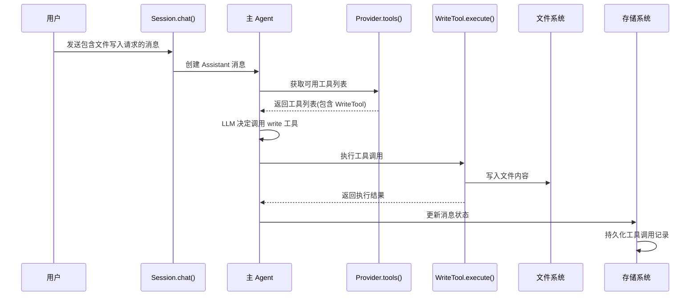
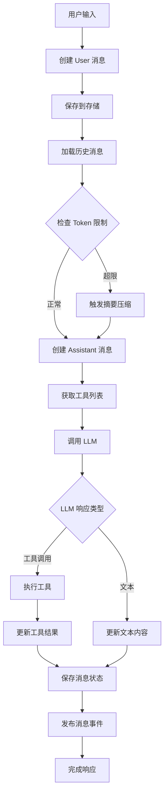

# OpenCode 编码代理系统架构分析报告

## 1. 系统架构概述

OpenCode 是一个基于 TypeScript 构建的编码代理系统，采用单一主 Agent 架构设计。系统核心由以下几个主要组件构成：

### 1.1 核心组件

- **Session 管理器**: 负责会话生命周期管理和消息流转
- **Provider 系统**: 管理不同 LLM 提供商和模型
- **Tool 系统**: 提供文件操作、代码执行等工具能力
- **消息系统**: 处理用户和 AI 之间的消息交换
- **存储系统**: 持久化会话数据和消息历史

### 1.2 单一 Agent 架构

系统采用单一主 Agent 设计，所有工具调用都由同一个 Agent 实例处理：



## 2. Agent 架构分析

### 2.1 主 Agent 组件

系统中只有一个主 Agent，位于 `packages/opencode/src/session/index.ts` 的 `chat` 函数中。该 Agent 负责：

- 接收用户输入并创建用户消息
- 调用 LLM 生成响应
- 执行工具调用
- 管理消息历史和上下文

### 2.2 Write File 工具调用链路

Write File 工具的调用链路如下：



## 3. 工具调用与消息上下文

### 3.1 工具调用记录保存机制

工具调用的完整记录会被保存到消息上下文中：

<augment_code_snippet path="packages/opencode/src/session/index.ts" mode="EXCERPT">
````typescript
// 工具调用结果会被包装成 ToolPart 并添加到消息中
const tools: Record<string, AITool> = {}
for (const item of await Provider.tools(input.providerID)) {
  tools[item.id.replaceAll(".", "_")] = tool({
    id: item.id as any,
    description: item.description,
    inputSchema: item.parameters as ZodSchema,
    async execute(args, opts) {
      const result = await item.execute(args, {
        sessionID: input.sessionID,
        abort: abort.signal,
        messageID: next.id,
        metadata: async (val) => {
          // 更新工具调用状态到消息中
          const match = next.parts.find(
            (p): p is MessageV2.ToolPart => p.type === "tool" && p.id === opts.toolCallId,
          )
          if (match && match.state.status === "running") {
            match.state.title = val.title
            match.state.metadata = val.metadata
          }
          await updateMessage(next)
        },
      })
      return result
    }
  })
}
````
</augment_code_snippet>

### 3.2 消息持久化机制

每次工具调用后，消息都会被持久化到存储系统：

<augment_code_snippet path="packages/opencode/src/session/index.ts" mode="EXCERPT">
````typescript
async function updateMessage(msg: MessageV2.Info) {
  await Storage.writeJSON("session/message/" + msg.sessionID + "/" + msg.id, msg)
  Bus.publish(MessageV2.Event.Updated, {
    info: msg,
  })
}
````
</augment_code_snippet>

### 3.3 下次对话时的上下文可见性

在下次对话时，LLM 能够看到之前的工具调用记录：

1. **消息加载**: `messages(sessionID)` 函数会加载所有历史消息
2. **消息转换**: `MessageV2.toModelMessage()` 将内部消息格式转换为 LLM 可理解的格式
3. **上下文传递**: 完整的消息历史（包括工具调用）会传递给 LLM

## 4. 文件状态同步机制

### 4.1 文件时间戳跟踪

系统通过 `FileTime` 模块跟踪文件的读取和修改时间：

<augment_code_snippet path="packages/opencode/src/file/time.ts" mode="EXCERPT">
````typescript
export namespace FileTime {
  export function read(sessionID: string, file: string) {
    const { read } = state()
    read[sessionID] = read[sessionID] || {}
    read[sessionID][file] = new Date()
  }
  
  export async function assert(sessionID: string, file: string) {
    const lastRead = get(sessionID, file)
    if (!lastRead) throw new Error(`File ${file} was not read in this session`)
    // 检查文件是否在读取后被修改
  }
}
````
</augment_code_snippet>

### 4.2 文件修改检测

Write Tool 在执行前会检查文件是否在上次读取后被修改：

<augment_code_snippet path="packages/opencode/src/tool/write.ts" mode="EXCERPT">
````typescript
async execute(params, ctx) {
  const file = Bun.file(filepath)
  const exists = await file.exists()
  if (exists) await FileTime.assert(ctx.sessionID, filepath)
  // 如果文件在读取后被修改，assert 会抛出错误
}
````
</augment_code_snippet>

### 4.3 AI 修改行为

当用户手动修改文件后，AI 再次修改时的行为：

1. **基于工具调用历史**: AI 主要基于消息历史中的工具调用记录进行修改
2. **文件状态检查**: Write Tool 会检测文件是否被外部修改
3. **强制重新读取**: 如果检测到外部修改，系统会要求先使用 Read Tool 重新读取文件

## 5. 上下文压缩机制

### 5.1 触发条件

上下文压缩在以下条件下触发：

<augment_code_snippet path="packages/opencode/src/session/index.ts" mode="EXCERPT">
````typescript
// 自动压缩触发条件
const previous = msgs.at(-1) as MessageV2.Assistant
if (previous) {
  const tokens = previous.tokens.input + previous.tokens.cache.read + 
                 previous.tokens.cache.write + previous.tokens.output
  if (model.info.limit.context &&
      tokens > Math.max((model.info.limit.context - (model.info.limit.output ?? 0)) * 0.9, 0)) {
    await summarize({
      sessionID: input.sessionID,
      providerID: input.providerID,
      modelID: input.modelID,
    })
    return chat(input)
  }
}
````
</augment_code_snippet>

**触发条件**:
- Token 使用量超过模型上下文限制的 90%
- 计算包括输入、输出、缓存读写的总 Token 数

### 5.2 压缩算法

压缩算法采用 LLM 生成摘要的方式：

<augment_code_snippet path="packages/opencode/src/session/index.ts" mode="EXCERPT">
````typescript
export async function summarize(input: { sessionID: string; providerID: string; modelID: string }) {
  const msgs = await messages(input.sessionID)
  const lastSummary = msgs.findLast((msg) => msg.role === "assistant" && msg.summary === true)?.id
  const filtered = msgs.filter((msg) => !lastSummary || msg.id >= lastSummary)
  
  // 创建摘要消息
  const next: MessageV2.Info = {
    // ... 消息配置
    summary: true,  // 标记为摘要消息
  }
  
  // 使用 LLM 生成摘要
  const result = streamText({
    messages: [
      ...system.map((x): ModelMessage => ({ role: "system", content: x })),
      ...MessageV2.toModelMessage(filtered),
      {
        role: "user",
        content: [{
          type: "text",
          text: "Provide a detailed but concise summary of our conversation above..."
        }]
      }
    ]
  })
}
````
</augment_code_snippet>

### 5.3 压缩策略

1. **增量压缩**: 只压缩自上次摘要以来的消息
2. **摘要标记**: 压缩后的消息标记为 `summary: true`
3. **消息过滤**: 后续对话只包含最新摘要之后的消息
4. **递归调用**: 压缩完成后重新调用 `chat()` 函数继续处理

## 6. 消息流转流程



## 7. 关键发现总结

1. **单一 Agent 架构**: 系统采用单一主 Agent 设计，所有工具调用都由同一个实例处理
2. **完整上下文保存**: 工具调用记录完整保存在消息历史中，LLM 在后续对话中可以访问
3. **智能文件同步**: 通过时间戳跟踪和断言机制确保文件状态一致性
4. **自动上下文管理**: 基于 Token 使用量自动触发摘要压缩，保持对话连续性
5. **事件驱动架构**: 使用 Bus 系统进行组件间通信，支持实时状态更新

这种架构设计确保了 OpenCode 能够维护长期对话上下文，同时有效管理资源使用和文件状态一致性。
